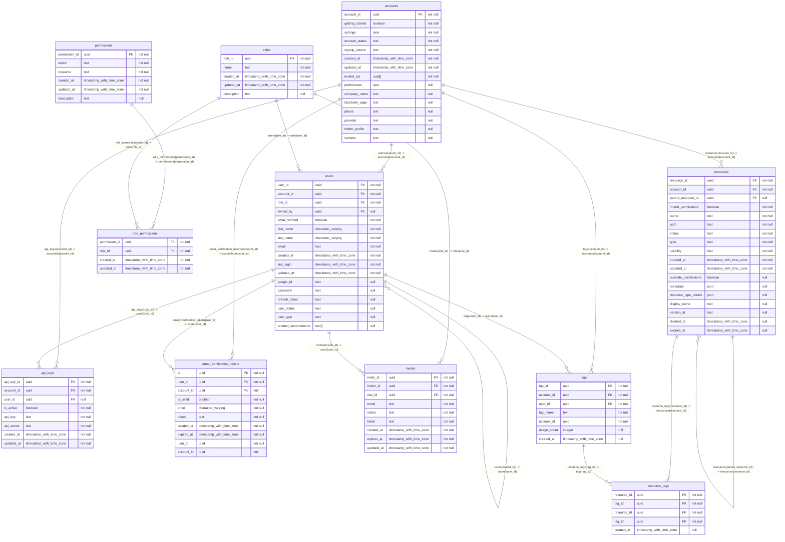

## Diagram

## Indexes

### `accounts`

- `accounts_pkey`

### `api_keys`

- `api_keys_api_key_unique`
- `api_keys_pkey`

### `email_verification_tokens`

- `email_verification_tokens_pkey`
- `email_verification_tokens_user_id_account_id_unique`

### `invites`

- `invites_pkey`
- `invites_token_unique`

### `permissions`

- `permissions_pkey`

### `resource_tags`

- `resource_tags_resource_id_tag_id_pk`
- `resource_tags_tag_id_idx`

### `resources`

- `resources_pkey`

### `role_permissions`

- `unique_role_permission`

### `roles`

- `roles_name_unique`
- `roles_pkey`

### `tags`

- `tags_pkey`
- `unique_account_tag`

### `users`

- `users_email_unique`
- `users_google_id_unique`
- `users_pkey`
